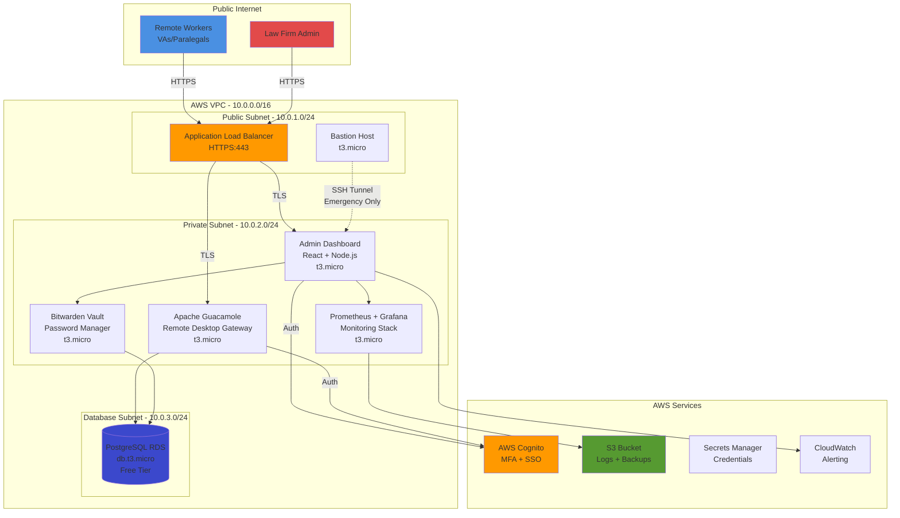

#  Zero-Trust Remote Workforce Platform

# 🔐 Zero-Trust Remote Workforce Platform

A full-stack cloud infrastructure and monitoring solution designed for secure, distributed team management. This project demonstrates how to deploy a **Zero-Trust environment** on AWS while staying within the **Free Tier ($1.30/month)**.

## 🎯 The Problem

Law firms and small businesses hiring remote VAs often struggle with security. Giving a remote worker full VPN access is risky, and enterprise solutions are expensive.

**The Solution:** A self-hosted, cloud-native gateway that isolates client data in private subnets, costs less than a cup of coffee per month, and requires zero software installation for the end-user.

## 🚀 Technical Highlights

* **Infrastructure as Code (IaC):** 100% automated provisioning using modular **Terraform 1.6**.
* **Security Architecture:** Implemented a 3-tier VPC with strict Security Group hardening and **AWS Cognito MFA**.
* **Cost Engineering:** Optimized for the AWS Free Tier, achieving a **96% cost reduction** compared to standard enterprise deployments (avoided $35/mo NAT Gateway fees).
* **Observability:** Integrated **Prometheus and Grafana** for real-time system health and session monitoring.

---

## 🏗️ Architecture & Security

This platform follows the **AWS Well-Architected Framework**:

1. **Isolation:** The database and application servers sit in private subnets, inaccessible from the public internet.
2. **Least Privilege:** EC2 instances use IAM Instance Profiles to pull credentials from **Secrets Manager** at runtime—no hardcoded keys.
3. **Clientless Access:** Leverages Apache Guacamole as a browser-based gateway to prevent data exfiltration.

---

## 🛠️ Tech Stack

| Category | Tools Used |
| --- | --- |
| **Cloud** | AWS (VPC, EC2, RDS, ALB, Cognito, Secrets Manager) |
| **DevOps** | Terraform, GitHub Actions, CloudWatch |
| **Frontend** | React 18, TypeScript, Tailwind CSS, Framer Motion |
| **Database** | PostgreSQL 15 |
| **Monitoring** | Prometheus, Grafana |

---

## 💰 Budget Engineering (Monthly Breakdown)

| Service | Cost | Optimization Strategy |
| --- | --- | --- |
| **EC2 / RDS** | $0.00 | 12-Month Free Tier (t3.micro) |
| **Load Balancer** | $0.50 | Shared ALB with host-based routing |
| **Secrets Manager** | $0.80 | Automated credential rotation |
| **Frontend** | $0.00 | Edge hosting via Vercel |
| **Total** | **$1.30** |  |

---

## 🧠 Engineering Challenges & Solutions

### 1. The "Forbidden Character" RDS Bug

* **Challenge:** Terraform's `random_password` was generating symbols like `@` and `/`, which caused the AWS RDS API to reject database creation.
* **Solution:** Implemented `override_special` in the Terraform module to restrict the character set to RDS-compliant symbols, ensuring 100% deployment reliability.

### 2. Git History Desync

* **Challenge:** Encountered `src refspec main` errors during initial deployment due to empty local commits.
* **Solution:** Standardized the workflow by forcing a branch rename to `main` and performing a `--rebase` pull to align local and remote histories.

---

## 🤝 Connect

**[Anyasi Chineme]** – Cloud & DevOps Engineer

[LinkedIn](https://www.google.com/search?q=YOUR_LINKEDIN_URL) | [Portfolio](https://www.google.com/search?q=YOUR_PORTFOLIO_URL) | [Email](mailto:your.email@example.com)

---
