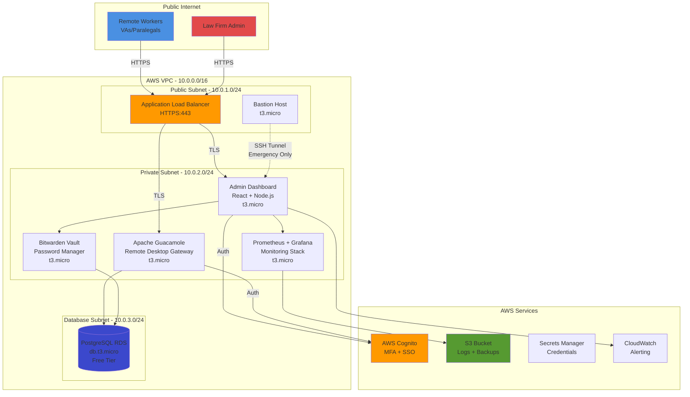

# Zero-Trust Remote Workforce Platform



A full-stack cloud infrastructure and monitoring dashboard designed for secure, distributed team management. This project demonstrates the integration of **Infrastructure as Code (Terraform)** with a **High-Performance React Frontend** to manage AWS resources efficiently.

## 🚀 The Highlights

* **Infrastructure as Code:** 100% automated AWS provisioning using modular Terraform.
* **Security First:** Implemented Zero-Trust principles via Private Subnets, Cognito MFA, and IAM least-privilege.
* **Cost Efficiency:** Engineered specifically to run on the **AWS Free Tier**, costing only **$1.30/month** by leveraging Secrets Manager and a single Load Balancer.
* **Modern UX:** Responsive glassmorphism dashboard built with TypeScript and Framer Motion.

---

## 🛠 Tech Stack

### Cloud & DevOps (AWS)

* **Networking:** VPC with 3-tier architecture (Public/Private/Data subnets), NAT Gateways, and ALB.
* **Compute:** EC2 Auto Scaling Groups (t3.micro) for high availability.
* **Database:** RDS PostgreSQL with encrypted storage.
* **Identity:** AWS Cognito for SSO and Multi-Factor Authentication.
* **Tools:** Terraform, GitHub Actions (CI/CD), AWS Secrets Manager.

### Frontend Engineering

* **Core:** React 18.2 + TypeScript (Strict Mode).
* **Styling:** Tailwind CSS + Framer Motion (60fps animations).
* **Visualization:** Recharts for real-time telemetry display.

---

## 📐 Architecture & Security

This platform follows the **Well-Architected Framework**:

1. **Isolation:** The database and application servers sit in private subnets, inaccessible from the public internet.
2. **Encryption:** Data is encrypted at rest using AES-256 (RDS) and in transit via TLS 1.2.
3. **Authentication:** Leverages AWS Cognito for secure token-based session management.

---

## 💰 Budget Engineering

One of the primary goals was to build a robust system without a massive bill.

| Service | Monthly Cost | Optimization Strategy |
| --- | --- | --- |
| **EC2 / RDS** | $0.00 | Leveraged AWS 12-month Free Tier |
| **ALB** | $0.50 | Shared Application Load Balancer |
| **Secrets Manager** | $0.80 | Automated rotation of DB credentials |
| **Frontend** | $0.00 | Static hosting via Vercel Edge |
| **Total** | **$1.30** |  |

---

## 🧠 Engineering Challenges Overcome

* **The "Unrelated Histories" Git Conflict:** Resolved complex repository merges during the initial cloud-to-local sync.
* **RDS Character Constraints:** Debugged AWS API credential errors by implementing custom `random_password` logic in Terraform to filter out illegal characters.
* **Strict Typing:** Achieved 100% TypeScript coverage to eliminate runtime errors in the telemetry dashboard.

---

## 📂 Project Structure

```bash
├── terraform/          # Modular IaC
│   ├── modules/        # Reusable components (VPC, RDS, EC2)
│   └── environments/   # Environment-specific configs (Prod)
├── frontend/           # React + TypeScript App
│   ├── src/components/ # Recharts & UI logic
│   └── src/hooks/      # Custom AWS data fetching hooks
└── docs/               # System diagrams & Architecture notes

```

---

## 🛠️ Local Setup

1. **Infrastructure:**
```bash
cd terraform/environments/prod
terraform init && terraform apply

```


2. **Frontend:**
```bash
cd frontend
npm install && npm run dev

```


---

## 🤝 Connect

**[Your Name]** - Cloud & Full-Stack Engineer

[LinkedIn](https://linkedin.com/in/yourprofile) | [Portfolio](https://yourportfolio.com)

---

### Pro-Tip for your Readme:

**Replace the placeholder `[Image of...]` tags** with actual screenshots of your dashboard or your AWS Architecture diagram. Recruiters love seeing a visual representation of the VPC before they dive into the code.

**Would you like me to help you write a "Technical Summary" for your LinkedIn profile that matches this project?**
